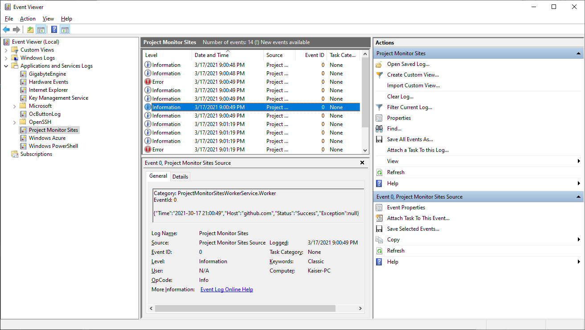
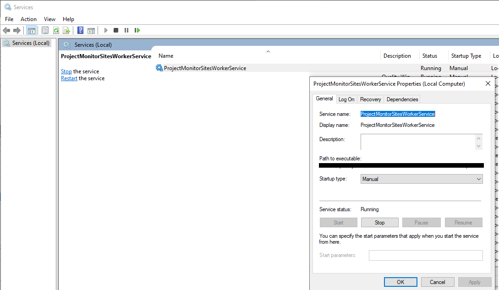

# 1. What is this project

It is a small / simple project that shows how:

- Use a Worker Service (Windows Service)
- Use Ping() class
- Use EventLog to capture events of Service

# 2. Project Type Worker Service

.NET 7.0

# 3. Utils commands

- sc create MyServiceName binPath="MY .EXE PATH"
- sc delete "MyServiceName"

# 4. Result of this project

