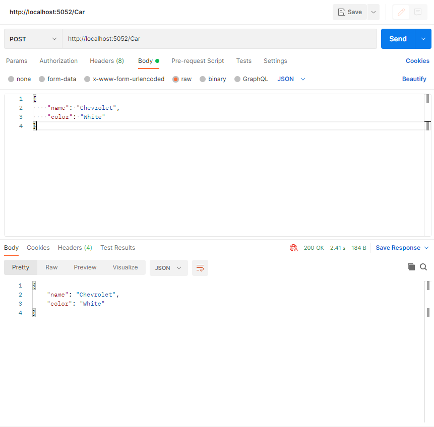
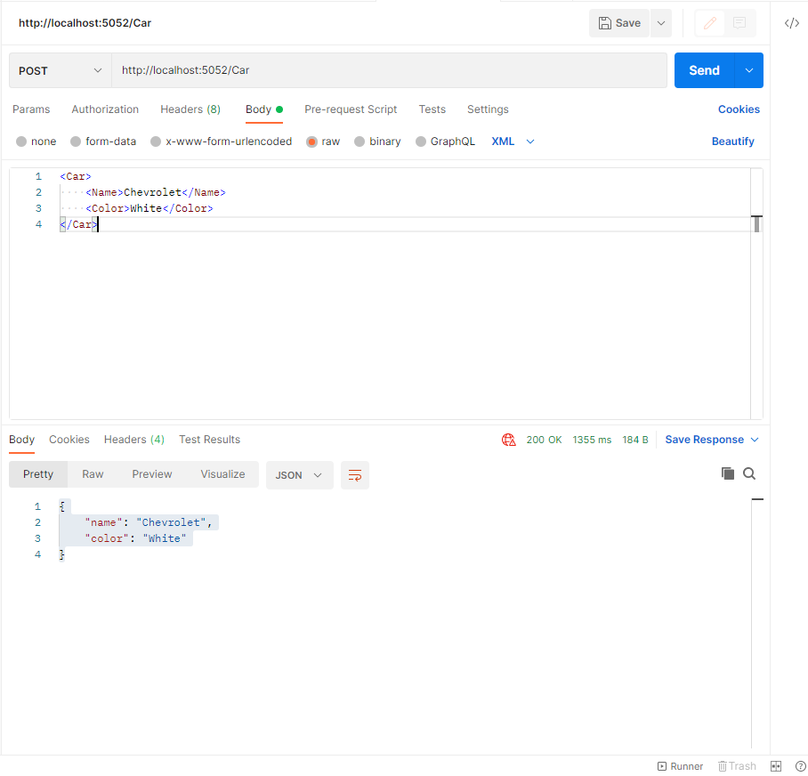

# 1. What is this project

This is a sample project showing how to accept body in format xml (application/xml) or json (application/json).

# 2. Project type console

.NET 6.0

# 3. How to test

## 3.1. Json



```
{
    "name": "Chevrolet",
    "color": "White"
}
```

## 3.2. XML



```
<Car>
    <Name>Chevrolet</Name>
    <Color>White</Color>
</Car>
```
