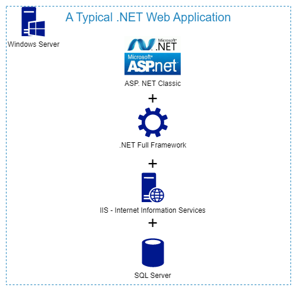
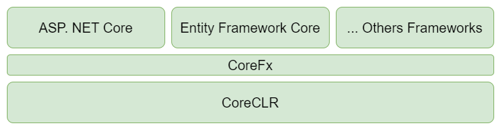

# Dotnet overview and commands <!-- omit in toc -->

## Contents <!-- omit in toc -->

- [1. Overview .NET Core](#1-overview-net-core)
  - [1.1. Typical dotnet application](#11-typical-dotnet-application)
  - [1.2. Why Microsoft created .NET Core?](#12-why-microsoft-created-net-core)
  - [1.3. Why does it matter?](#13-why-does-it-matter)
- [2. .NET Standard](#2-net-standard)
  - [2.1. .NET Standard Why?](#21-net-standard-why)
  - [2.2. Portable Class Library (PCL) and Shared Projects?](#22-portable-class-library-pcl-and-shared-projects)
  - [2.3. .NET Standard 2.0](#23-net-standard-20)
- [3. Deployments options](#3-deployments-options)
  - [3.1. Self contained](#31-self-contained)
  - [3.2. Framework Dependent](#32-framework-dependent)
  - [3.3. Package Size](#33-package-size)
- [4. Performance](#4-performance)
  - [4.1. Measuring memory](#41-measuring-memory)
- [5. Commands](#5-commands)
  - [5.1. General commands](#51-general-commands)
  - [5.2. Solution commands](#52-solution-commands)
  - [5.3. Aspnet codegenerator commands](#53-aspnet-codegenerator-commands)
- [6. Tools](#6-tools)

# 1. Overview .NET Core

## 1.1. Typical dotnet application

- 
  - Tied to Windows and IIS.
  - First release: 2002 (no cloud, no Microservices).

## 1.2. Why Microsoft created .NET Core?

- New requirements:
  - Cross-platform.
  - Open-Source.
  - "Similar" to classic .NET.
  - Good for cloud, good for microservices -> lightweight and fast.
- **PERFORMANCE!!!!**
- 

## 1.3. Why does it matter?

- Almost zero framework overhead = almost zero overhead for your application.
- It's a C# library built on top of .NET Core: you have the same platform available for your libraries and applications.
- Many C# features and new .NET APIs were "invented" during the development of .NET Core and ASP.NET Core to achieve this performance.

# 2. .NET Standard

- Contract that defines an API surface.
- Versions: 1.0 - 2.0.
- A list of Types and methods that are available in different versions.
- ".NET" flavors implement the standard.
- .NET Standard version are backward compatible.

## 2.1. .NET Standard Why?

- Code sharing!
- Target the standard - run everywhere.
- Full framework, .NET Core, Mono (Xamarin): all support .NET Standard 2.0.
- As a library author: you should target .NET Standard (and not e.g. .NET Core).

## 2.2. Portable Class Library (PCL) and Shared Projects?

- PCL and Shared Projects: Previous attempt to share code across .NET Platforms (e.g. Full Framework and Xamarin).
- **Recommendation: use .NET Standard.**

## 2.3. .NET Standard 2.0

- 
- Doubled the number of APIs.
- Supports `mscorlib` based .NET Framework libs.

# 3. Deployments options

- Self contained.
- Framework Dependent or Shared Framework.
- [.NET application publishing overview](https://learn.microsoft.com/en-us/dotnet/core/deploying/)

## 3.1. Self contained

- Contains the CLR.
- No preinstalled framework needed.
- Bigger deployment package which targets a specific OS (The executable is not cross-platform).
- `dotnet publish --runtime win-x86 --self-contained true`

## 3.2. Framework Dependent

- Only contains the application’s code.
- Requires preinstalled .NET Core on the target machine.
- Cross platform deployment package.
- Small package size.
- **Default.**
- `dotnet publish --runtime win-x86 --self-contained false`

## 3.3. Package Size

# 4. Performance

## 4.1. Measuring memory

# 5. Commands

## 5.1. General commands

- Create a Web API into the project
  - dotnet new webapi -o `<output_path>`
- Add reference to another ClassLib
  - dotnet add `<target_project>` reference `<project>` # Ex: dotnet add Calculations.Test reference Calculations
- Step By Step - Create class library into the project
  1. dotnet new classlib -o Infrastructure
  2. dotnet sln add "name of classlib"
  3. dotnet add reference ../classlib/
- Step By Step - Run project
  1. First enter in the path it contains startup.cs file
  2. Second run command: dotnet run
  3. Optional: dotnet watch run
- Restore project, download all dependencies of project
  - dotnet restore
- All informations about dotnet in the machine
  - dotnet --info
- Build project and generate release
  - dotnet publish -c Release
- Verif if machines has https certificate valid
  - dotnet dev-certs https
- Trust localhost certificate
  - dotnet dev-certs https -t
- List of tools installer with dotnet
  - dotnet tool list -g # -g appear globar
- Generate NuGet package
  - dotnet pack
  - **OR**
  - Adding this tag to automatically generate package on build:
    - <GeneratePackageOnBuild>true</GeneratePackageOnBuild>

## 5.2. Solution commands

- Create a solution
  - dotnet new sln
- Add project into a solution
  - dotnet sln add `<dotnet_project>` # Remember, he must exists .csproj file.

## 5.3. Aspnet codegenerator commands

- dotnet aspnet-codegenerator --project "D:\CSharp\DotnetDapperOverview\ExampleDapper" controller --force --controllerName CompanyController --model ExampleDapper.Models.Company --dataContext ExampleDapper.Data.ApplicationDbContext --relativeFolderPath Controllers --controllerNamespace ExampleDapper.Controllers

# 6. Tools

- dotnet tool install --global dotnet-aspnet-codegenerator --version X.X.X
